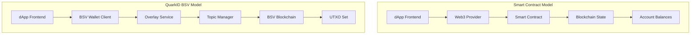
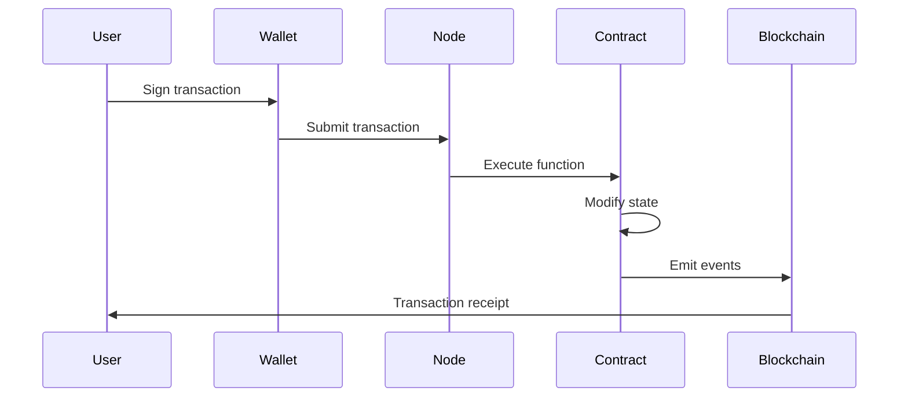
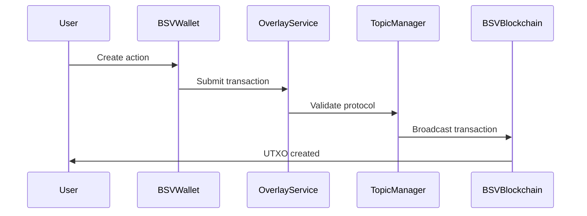

# Smart Contracts vs BSV UTXO: 1-to-1 Architectural Comparison

This document provides a comprehensive comparison between traditional smart contract architectures (Ethereum/Solidity) and QuarkID's BSV UTXO-based implementation. It serves as a guide for developers transitioning from account-based blockchain development to UTXO-based systems.

## Table of Contents

1. [Executive Summary](#executive-summary)
2. [Fundamental Architecture Differences](#fundamental-architecture-differences)
3. [State Management Comparison](#state-management-comparison)
4. [Transaction Flow Comparison](#transaction-flow-comparison)
5. [Development Patterns Translation](#development-patterns-translation)
6. [Security Model Differences](#security-model-differences)
7. [Performance and Scalability](#performance-and-scalability)
8. [Developer Experience Comparison](#developer-experience-comparison)
9. [Migration Guide](#migration-guide)
10. [Code Examples](#code-examples)

## Executive Summary

QuarkID implements a **pure BSV UTXO-based architecture** with **no traditional smart contracts**. Instead of account-based state management and contract execution, QuarkID uses:

- **UTXO Chains** for state management
- **BSV Overlay Protocols** for validation logic
- **PushDrop Tokens** for data storage
- **Topic Managers** for transaction validation
- **BRC-48 Protocol** for standardized operations

This architecture provides equivalent functionality to smart contracts while leveraging Bitcoin's proven security model and unlimited scalability.

## Fundamental Architecture Differences

### Account-Based vs UTXO-Based Models

| **Aspect** | **Smart Contracts (Account-Based)** | **QuarkID BSV (UTXO-Based)** |
|------------|-------------------------------------|------------------------------|
| **State Storage** | Global state variables in contracts | Individual UTXO outputs with embedded data |
| **Identity Model** | Ethereum addresses (0x...) | Decentralized Identifiers (did:bsv:...) |
| **Transaction Model** | Account balance modifications | UTXO consumption and creation |
| **State Updates** | Function calls modify contract state | New UTXOs created with updated data |
| **Validation Logic** | Contract bytecode execution | Overlay protocol validation |
| **Data Persistence** | Contract storage slots | UTXO script data and overlay indexing |

### Network Architecture



## State Management Comparison

### 1. State Storage Patterns

#### Smart Contract State Variables
```solidity
// Traditional Smart Contract
contract DIDRegistry {
    mapping(address => DIDDocument) public didDocuments;
    mapping(address => bool) public isActive;
    uint256 public totalDIDs;
    
    function createDID(DIDDocument memory doc) public {
        didDocuments[msg.sender] = doc;
        isActive[msg.sender] = true;
        totalDIDs++;
    }
}
```

#### QuarkID BSV UTXO State
```typescript
// QuarkID BSV Implementation
export class BsvOverlayDidRegistryService {
  async createDID(request: CreateDidRequest): Promise<CreateDidResponse> {
    // Create UTXO with DID document embedded
    const template = new PushDrop(this.config.walletClient, 'quarkid_did');
    const didAsNumberArr = Utils.toArray(JSON.stringify(request.didDocument), 'utf8');
    const script = await template.lock([didAsNumberArr], protocolID, keyID, counterparty, true, true);
    
    // State is stored in the UTXO itself
    const createResult = await this.config.walletClient.createAction({
      description: 'Create DID transaction with BSV overlay',
      outputs: [{
        lockingScript: script.toHex(),
        satoshis: 1,
        outputDescription: 'DID Document'
      }]
    });
    
    // DID derived from transaction coordinates
    const did = `did:bsv:${this.config.topic}:${createResult.txid}:0`;
    return { did, didDocument: request.didDocument, transaction, metadata };
  }
}
```

### 2. State Queries and Updates

| **Operation** | **Smart Contract** | **QuarkID BSV** |
|---------------|-------------------|-----------------|
| **Read State** | `contract.method.call()` | Overlay service UTXO lookup |
| **Update State** | `contract.method.send()` | Create new UTXO, spend old UTXO |
| **State History** | Event logs (optional) | Complete UTXO chain (immutable) |
| **Atomic Updates** | Single transaction | Single BSV transaction |
| **Rollback** | Revert transaction | Not applicable (UTXOs immutable) |

## Transaction Flow Comparison

### Smart Contract Transaction Flow



### QuarkID BSV Transaction Flow



### Transaction Lifecycle Comparison

| **Phase** | **Smart Contract** | **QuarkID BSV** |
|-----------|-------------------|-----------------|
| **Preparation** | Encode function call with parameters | Create UTXO output with embedded data |
| **Validation** | Node validates against contract bytecode | Topic Manager validates against protocol rules |
| **Execution** | EVM executes contract function | BSV network validates and confirms transaction |
| **State Change** | Contract storage modified | New UTXO created, old UTXO consumed (if update) |
| **Finalization** | Transaction mined in block | Transaction confirmed in BSV block |
| **Indexing** | Events indexed by RPC providers | UTXOs indexed by overlay service |

## Development Patterns Translation

### 1. Data Storage Patterns

#### Smart Contract Storage
```solidity
// Mapping pattern
mapping(address => UserData) users;
mapping(bytes32 => bool) isValid;

// Array pattern  
UserData[] allUsers;

// Struct pattern
struct UserData {
    string name;
    uint256 balance;
    bool active;
}
```

#### QuarkID BSV Storage
```typescript
// Embedded data pattern
interface DIDRecord {
  txid: string;           // UTXO identifier
  outputIndex: number;    // UTXO output index
  serialNumber: Base64String;
  atomicBeef: AtomicBEEF; // Complete transaction data
  createdAt: Date;
}

// Data embedded in UTXO script
const didAsNumberArr = Utils.toArray(JSON.stringify(didDocument), 'utf8');
const script = await template.lock([didAsNumberArr], protocolID, keyID, counterparty);

// Overlay indexing for queries
await this.records.insertOne({
  txid: result.txid,
  outputIndex: 0,
  serialNumber: serialNumber,
  atomicBeef: result.tx
});
```

### 2. Access Control Patterns

#### Smart Contract Access Control
```solidity
// Modifier pattern
modifier onlyOwner() {
    require(msg.sender == owner, "Not authorized");
    _;
}

function updateData(uint256 value) public onlyOwner {
    data = value;
}

// Role-based access
mapping(address => bool) public admins;
```

#### QuarkID BSV Access Control
```typescript
// Key-based control through UTXO ownership
export interface CreateDidRequest {
  didDocument: Record<string, unknown>;
  controllerPublicKeyHex: string;  // Controls UTXO spending
  feePerKb?: number;
}

// Update requires spending the current UTXO
export interface UpdateDidRequest {
  currentBrc48TxHex: string;       // Current UTXO to spend
  currentBrc48Vout: number;
  currentControllerPrivateKeyHex: string;  // Private key to spend UTXO
  newDidDocument: Record<string, unknown>;
  newControllerPublicKeyHex: string;       // New controller
}

// Topic Manager validation
async admit(beef: AtomicBEEF, topic: string): Promise<AdmittanceInstructions> {
  // Validate protocol compliance instead of access control
  if (!this.validateBRC48Protocol(beef)) {
    return { admit: false, reason: 'Invalid protocol format' };
  }
  return { admit: true };
}
```

### 3. Event and Logging Patterns

#### Smart Contract Events
```solidity
// Event definition
event DIDCreated(address indexed owner, bytes32 indexed didId, string document);
event DIDUpdated(address indexed owner, bytes32 indexed didId, string newDocument);

// Event emission
function createDID(string memory document) public {
    bytes32 didId = keccak256(abi.encodePacked(msg.sender, block.timestamp));
    dids[didId] = document;
    emit DIDCreated(msg.sender, didId, document);
}
```

#### QuarkID BSV Transaction Indexing
```typescript
// Transaction-based "events" through overlay indexing
export class DIDTopicManager {
  async admit(beef: AtomicBEEF, topic: string): Promise<AdmittanceInstructions> {
    const result = await this.validateAndIndex(beef);
    
    // "Event" data stored in overlay database
    await this.storageManager.storeRecord(
      result.txid,
      result.outputIndex,
      result.serialNumber,
      beef
    );
    
    // Real-time notifications via overlay service
    this.notifySubscribers('DIDCreated', {
      txid: result.txid,
      did: `did:bsv:${topic}:${result.txid}:${result.outputIndex}`,
      timestamp: new Date()
    });
    
    return { admit: true };
  }
}

// Query "events" through overlay service
async getDIDHistory(did: string): Promise<DIDHistoryItem[]> {
  // Parse DID to get transaction coordinates
  const [, , topic, txid, vout] = did.split(':');
  
  // Query complete UTXO chain history
  return await this.traceUTXOChain(txid, parseInt(vout));
}
```

## Security Model Differences

### 1. Attack Vectors and Mitigations

| **Attack Vector** | **Smart Contract Risk** | **QuarkID BSV Mitigation** |
|-------------------|-------------------------|----------------------------|
| **Reentrancy** | Contract calls other contracts recursively | Not applicable - no function calls |
| **Integer Overflow** | Arithmetic operations can overflow | Limited arithmetic, mostly data storage |
| **Access Control** | Modifier bypasses, privilege escalation | UTXO ownership inherently controls access |
| **Front-running** | MEV attacks on transaction ordering | BSV first-seen rule prevents front-running |
| **Gas Griefing** | Out-of-gas attacks | Fixed transaction fees, no execution limits |
| **Storage Collision** | Proxy upgrade conflicts | Each UTXO has isolated data space |
| **Oracle Manipulation** | External data source attacks | Overlay validation uses BSV consensus |

### 2. Cryptographic Security

#### Smart Contract Security
```solidity
// Signature verification in contracts
function verifySignature(bytes32 hash, bytes memory signature, address signer) public pure returns (bool) {
    return ecrecover(hash, signature) == signer;
}

// Merkle proof verification
function verifyMerkleProof(bytes32[] memory proof, bytes32 root, bytes32 leaf) public pure returns (bool) {
    // Complex verification logic
}
```

#### QuarkID BSV Security
```typescript
// BSV native signature verification
export class BsvOverlayDidRegistryService {
  private async validateUTXOSpending(
    currentTxHex: string,
    currentVout: number,
    privateKeyHex: string
  ): Promise<boolean> {
    // BSV transaction validation is handled by the network
    // Private key ownership proves authorization
    const transaction = Transaction.fromHex(currentTxHex);
    const utxo = transaction.outputs[currentVout];
    
    // Network validates signature during transaction broadcast
    return this.config.walletClient.validateSignature(transaction, privateKeyHex);
  }
}

// Tamper-evident UTXO chains
async traceUTXOHistory(txid: string, vout: number): Promise<UTXOHistoryItem[]> {
  // Complete immutable history is preserved in blockchain
  // No possibility of history manipulation
  const history = [];
  let currentTxid = txid;
  let currentVout = vout;
  
  while (currentTxid) {
    const tx = await this.getTransaction(currentTxid);
    const previousInput = tx.inputs.find(input => 
      input.sourceTransaction === currentTxid && 
      input.sourceOutputIndex === currentVout
    );
    
    history.push({
      txid: currentTxid,
      vout: currentVout,
      timestamp: tx.timestamp,
      data: this.extractUTXOData(tx.outputs[currentVout])
    });
    
    if (previousInput) {
      currentTxid = previousInput.sourceTransaction;
      currentVout = previousInput.sourceOutputIndex;
    } else {
      break;
    }
  }
  
  return history.reverse(); // Chronological order
}
```

## Performance and Scalability

### 1. Throughput Comparison

| **Metric** | **Ethereum Smart Contracts** | **QuarkID BSV** |
|------------|------------------------------|-----------------|
| **TPS** | ~15 transactions/second | Unbounded (BSV scaling) |
| **Block Time** | 12-15 seconds | ~10 minutes (but instant propagation) |
| **Finality** | ~12-15 confirmations (3-5 minutes) | 1 confirmation (probabilistic) |
| **State Size** | Limited by gas costs | Limited by UTXO size (practical unlimited) |
| **Query Speed** | RPC node dependent | Overlay service (sub-second) |
| **Storage Cost** | High gas costs for storage | Fixed low transaction fee |

### 2. Scalability Patterns

#### Smart Contract Scaling
```solidity
// Layer 2 scaling solutions
contract L2Bridge {
    mapping(bytes32 => bytes32) public stateRoots;
    
    function commitStateRoot(bytes32 newRoot, bytes calldata proof) external {
        // Verify state transition
        require(verifyStateTransition(stateRoots[currentEpoch], newRoot, proof));
        stateRoots[++currentEpoch] = newRoot;
    }
}

// State channels
contract StateChannel {
    struct Channel {
        address[2] participants;
        uint256 balance;
        uint256 nonce;
        bool closed;
    }
}
```

#### QuarkID BSV Scaling
```typescript
// Native scaling through parallel processing
export class ParallelOverlayService {
  async processTransactionsBatch(transactions: Transaction[]): Promise<ProcessingResult[]> {
    // Each UTXO can be processed independently
    const results = await Promise.all(
      transactions.map(async (tx) => {
        // No global state contention
        return await this.processTransaction(tx);
      })
    );
    
    return results;
  }
  
  // Overlay network horizontal scaling
  async distributeTopicValidation(topic: string, transaction: Transaction): Promise<void> {
    const validators = await this.getTopicValidators(topic);
    
    // Distribute validation across multiple nodes
    const validationResults = await Promise.all(
      validators.map(validator => 
        validator.validateTransaction(transaction)
      )
    );
    
    // Consensus through majority validation
    const consensus = this.calculateConsensus(validationResults);
    if (consensus.valid) {
      await this.admitTransaction(transaction, topic);
    }
  }
}
```

## Developer Experience Comparison

### 1. Development Workflow

| **Phase** | **Smart Contract Development** | **QuarkID BSV Development** |
|-----------|-------------------------------|---------------------------|
| **Setup** | Hardhat/Truffle, Solidity compiler | BSV SDK, TypeScript, BSV wallet |
| **Testing** | Ganache/Hardhat Network | BSV testnet, overlay service |
| **Deployment** | Contract deployment transaction | Overlay topic registration |
| **Debugging** | Remix, transaction traces | BSV explorer, overlay logs |
| **Monitoring** | Event logs, contract calls | UTXO monitoring, overlay metrics |

### 2. Testing Patterns

#### Smart Contract Testing
```javascript
// Hardhat/Mocha testing
describe("DIDRegistry", function() {
  it("Should create a new DID", async function() {
    const didRegistry = await DIDRegistry.deploy();
    const document = "did:example:123";
    
    await didRegistry.createDID(document);
    
    const storedDoc = await didRegistry.didDocuments(owner.address);
    expect(storedDoc).to.equal(document);
  });
});
```

#### QuarkID BSV Testing
```typescript
// Jest testing with BSV SDK
describe('BsvOverlayDidRegistryService', () => {
  let registryService: BsvOverlayDidRegistryService;
  let mockWalletClient: jest.Mocked<WalletClient>;
  
  beforeEach(() => {
    mockWalletClient = createMockWalletClient();
    registryService = new BsvOverlayDidRegistryService({
      walletClient: mockWalletClient,
      overlayNodeEndpoint: 'http://localhost:8080',
      topic: 'test-topic'
    });
  });
  
  it('should create a DID with UTXO', async () => {
    const didDocument = { id: 'did:bsv:test:123' };
    const publicKeyHex = '02abc123...';
    
    mockWalletClient.createAction.mockResolvedValue({
      txid: 'abc123...',
      tx: new AtomicBEEF(...),
      outputs: [{ satoshis: 1, lockingScript: 'script...' }]
    });
    
    const result = await registryService.createDID({
      didDocument,
      controllerPublicKeyHex: publicKeyHex
    });
    
    expect(result.did).toBe('did:bsv:test-topic:abc123...:0');
    expect(result.didDocument).toEqual(didDocument);
    expect(mockWalletClient.createAction).toHaveBeenCalledWith({
      description: 'Create DID transaction with BSV overlay',
      outputs: expect.arrayContaining([
        expect.objectContaining({
          satoshis: 1,
          outputDescription: 'DID Document'
        })
      ])
    });
  });
});
```

### 3. Debugging and Monitoring

#### Smart Contract Debugging
```javascript
// Event monitoring
const contract = new ethers.Contract(address, abi, provider);

contract.on("DIDCreated", (owner, didId, document, event) => {
  console.log(`DID created: ${didId} by ${owner}`);
});

// Transaction debugging
const tx = await contract.createDID(document);
const receipt = await tx.wait();
console.log(`Gas used: ${receipt.gasUsed}`);
```

#### QuarkID BSV Monitoring
```typescript
// UTXO monitoring
export class UTXOMonitor {
  async monitorTopic(topic: string): Promise<void> {
    const overlayService = new OverlayService(this.config);
    
    await overlayService.subscribe(topic, async (transaction: Transaction) => {
      console.log(`New DID transaction: ${transaction.id()}`);
      
      // Extract DID document from UTXO
      const didData = this.extractDIDFromTransaction(transaction);
      console.log(`DID: ${didData.did}`);
      console.log(`Document: ${JSON.stringify(didData.document)}`);
      
      // Monitor transaction confirmation
      await this.waitForConfirmation(transaction.id());
      console.log(`Transaction confirmed: ${transaction.id()}`);
    });
  }
}

// Performance monitoring
export class OverlayMetrics {
  async getTopicStats(topic: string): Promise<TopicStats> {
    return {
      totalTransactions: await this.countTopicTransactions(topic),
      averageConfirmationTime: await this.getAverageConfirmationTime(topic),
      activeUTXOs: await this.countActiveUTXOs(topic),
      storageUsed: await this.calculateStorageUsed(topic)
    };
  }
}
```

## Migration Guide

### 1. Conceptual Mapping

| **Smart Contract Concept** | **QuarkID BSV Equivalent** | **Migration Notes** |
|----------------------------|----------------------------|---------------------|
| Contract deployment | Overlay topic registration | No code deployment, just protocol definition |
| Contract address | Topic identifier | Topic is human-readable string |
| Function call | UTXO creation/spending | Each operation creates new UTXO |
| State variable | UTXO embedded data | Data travels with the UTXO |
| Event emission | Transaction indexing | Events are transactions themselves |
| Access modifier | UTXO ownership | Private key controls UTXO spending |
| Contract upgrade | New topic version | Can maintain compatibility |
| Gas optimization | Transaction size optimization | Minimize UTXO size for efficiency |

### 2. Code Migration Examples

#### Migrating a Simple Registry Contract

**Before (Solidity)**:
```solidity
contract SimpleRegistry {
    mapping(address => string) public records;
    
    event RecordUpdated(address indexed owner, string data);
    
    function setRecord(string memory data) public {
        records[msg.sender] = data;
        emit RecordUpdated(msg.sender, data);
    }
    
    function getRecord(address owner) public view returns (string memory) {
        return records[owner];
    }
}
```

**After (QuarkID BSV)**:
```typescript
export class SimpleRegistryOverlay {
  constructor(
    private walletClient: WalletClient,
    private topic: string
  ) {}
  
  async setRecord(data: string, controllerPrivateKey: string): Promise<string> {
    // Create UTXO with embedded data
    const template = new PushDrop(this.walletClient, 'simple_registry');
    const protocolID = [SecurityLevels.Silent, 'simple registry'] as WalletProtocol;
    const keyID = Utils.toBase64(Random(21));
    const dataArray = Utils.toArray(data, 'utf8');
    
    const script = await template.lock([dataArray], protocolID, keyID, 'self', true, true);
    
    const result = await this.walletClient.createAction({
      description: 'Set registry record',
      outputs: [{
        lockingScript: script.toHex(),
        satoshis: 1,
        outputDescription: 'Registry Record'
      }]
    });
    
    // Return UTXO identifier instead of transaction hash
    return `${result.txid}:0`;
  }
  
  async getRecord(utxoId: string): Promise<string> {
    const [txid, vout] = utxoId.split(':');
    
    // Query overlay service for UTXO data
    const overlayResponse = await fetch(
      `${this.overlayEndpoint}/utxo/${txid}/${vout}`
    );
    
    const utxoData = await overlayResponse.json();
    return this.extractDataFromUTXO(utxoData);
  }
  
  async updateRecord(
    currentUtxoId: string, 
    newData: string, 
    privateKey: string
  ): Promise<string> {
    // Spend current UTXO and create new one
    const [currentTxid, currentVout] = currentUtxoId.split(':');
    
    // Create new UTXO with updated data
    const template = new PushDrop(this.walletClient, 'simple_registry');
    const newDataArray = Utils.toArray(newData, 'utf8');
    const script = await template.lock([newDataArray], protocolID, keyID, 'self', true, true);
    
    const result = await this.walletClient.createAction({
      description: 'Update registry record',
      inputs: [{
        sourceTransaction: currentTxid,
        sourceOutputIndex: parseInt(currentVout),
        unlockingScript: await this.createUnlockingScript(privateKey)
      }],
      outputs: [{
        lockingScript: script.toHex(),
        satoshis: 1,
        outputDescription: 'Updated Registry Record'
      }]
    });
    
    return `${result.txid}:0`;
  }
}
```

### 3. Architecture Migration Steps

1. **Identify State Variables** → **Design UTXO Data Structures**
   - Map each state variable to UTXO embedded data
   - Consider data size and access patterns

2. **Convert Function Logic** → **Create Topic Validation Rules**
   - Move validation logic to Topic Managers
   - Define protocol format and admission rules

3. **Replace Events** → **Implement Transaction Monitoring**
   - Set up overlay service subscriptions
   - Create indexing for historical queries

4. **Handle Access Control** → **Design Key Management**
   - Map role-based access to UTXO ownership
   - Implement key rotation through UTXO spending

5. **Optimize Gas Usage** → **Optimize Transaction Size**
   - Minimize UTXO data payload
   - Use efficient encoding formats

## Code Examples

### Complete DID Registry Implementation

#### Traditional Smart Contract Version
```solidity
// SPDX-License-Identifier: MIT
pragma solidity ^0.8.19;

contract DIDRegistry {
    struct DIDDocument {
        string document;
        address controller;
        uint256 created;
        uint256 updated;
        bool active;
    }
    
    mapping(bytes32 => DIDDocument) public dids;
    mapping(address => bytes32[]) public controllerDids;
    
    event DIDCreated(bytes32 indexed didId, address indexed controller, string document);
    event DIDUpdated(bytes32 indexed didId, address indexed controller, string newDocument);
    event DIDDeactivated(bytes32 indexed didId, address indexed controller);
    
    modifier onlyController(bytes32 didId) {
        require(dids[didId].controller == msg.sender, "Not authorized");
        require(dids[didId].active, "DID not active");
        _;
    }
    
    function createDID(string memory document) external returns (bytes32) {
        bytes32 didId = keccak256(abi.encodePacked(msg.sender, block.timestamp, document));
        
        require(dids[didId].created == 0, "DID already exists");
        
        dids[didId] = DIDDocument({
            document: document,
            controller: msg.sender,
            created: block.timestamp,
            updated: block.timestamp,
            active: true
        });
        
        controllerDids[msg.sender].push(didId);
        
        emit DIDCreated(didId, msg.sender, document);
        return didId;
    }
    
    function updateDID(bytes32 didId, string memory newDocument) external onlyController(didId) {
        dids[didId].document = newDocument;
        dids[didId].updated = block.timestamp;
        
        emit DIDUpdated(didId, msg.sender, newDocument);
    }
    
    function deactivateDID(bytes32 didId) external onlyController(didId) {
        dids[didId].active = false;
        
        emit DIDDeactivated(didId, msg.sender);
    }
    
    function getDID(bytes32 didId) external view returns (DIDDocument memory) {
        require(dids[didId].created > 0, "DID does not exist");
        return dids[didId];
    }
    
    function getControllerDIDs(address controller) external view returns (bytes32[] memory) {
        return controllerDids[controller];
    }
}
```

#### QuarkID BSV Equivalent Implementation
```typescript
// Complete BSV DID Registry Implementation
export interface DIDDocument {
  id: string;
  document: Record<string, unknown>;
  controller: string;
  created: Date;
  updated: Date;
  active: boolean;
}

export interface DIDMetadata {
  txid: string;
  vout: number;
  blockHeight?: number;
  timestamp?: Date;
  previousTxid?: string;
  previousVout?: number;
}

export class BsvDIDRegistry {
  constructor(
    private walletClient: WalletClient,
    private overlayService: OverlayService,
    private topic: string
  ) {}
  
  // Equivalent to createDID function
  async createDID(
    document: Record<string, unknown>,
    controllerPublicKeyHex: string
  ): Promise<{ did: string; metadata: DIDMetadata }> {
    
    const didDocument: DIDDocument = {
      id: '', // Will be set after transaction creation
      document,
      controller: controllerPublicKeyHex,
      created: new Date(),
      updated: new Date(),
      active: true
    };
    
    // Create UTXO with DID document
    const template = new PushDrop(this.walletClient, 'did_registry');
    const protocolID = [SecurityLevels.Silent, 'did registry'] as WalletProtocol;
    const keyID = Utils.toBase64(Random(21));
    const documentData = Utils.toArray(JSON.stringify(didDocument), 'utf8');
    
    const script = await template.lock(
      [documentData], 
      protocolID, 
      keyID, 
      'self', 
      true, 
      true
    );
    
    const result = await this.walletClient.createAction({
      description: 'Create DID document',
      outputs: [{
        lockingScript: script.toHex(),
        satoshis: 1,
        outputDescription: 'DID Document',
        customInstructions: JSON.stringify({
          protocolID,
          keyID,
          counterparty: 'self',
          operation: 'CREATE'
        })
      }]
    });
    
    const did = `did:bsv:${this.topic}:${result.txid}:0`;
    didDocument.id = did;
    
    // Index in overlay service (equivalent to event emission)
    await this.overlayService.indexTransaction(result.txid, {
      type: 'DID_CREATED',
      did,
      controller: controllerPublicKeyHex,
      document: didDocument
    });
    
    return {
      did,
      metadata: {
        txid: result.txid,
        vout: 0,
        timestamp: new Date()
      }
    };
  }
  
  // Equivalent to updateDID function
  async updateDID(
    did: string,
    newDocument: Record<string, unknown>,
    controllerPrivateKeyHex: string
  ): Promise<{ did: string; metadata: DIDMetadata }> {
    
    // Parse current DID to get UTXO coordinates
    const [, , topic, currentTxid, currentVout] = did.split(':');
    
    // Get current DID document
    const currentDIDData = await this.getDID(did);
    if (!currentDIDData.active) {
      throw new Error('DID is not active');
    }
    
    // Verify controller authorization (equivalent to onlyController modifier)
    const controllerPublicKeyHex = this.derivePublicKey(controllerPrivateKeyHex);
    if (currentDIDData.controller !== controllerPublicKeyHex) {
      throw new Error('Not authorized to update this DID');
    }
    
    const updatedDocument: DIDDocument = {
      ...currentDIDData,
      document: newDocument,
      updated: new Date()
    };
    
    // Create new UTXO with updated document
    const template = new PushDrop(this.walletClient, 'did_registry');
    const protocolID = [SecurityLevels.Silent, 'did registry'] as WalletProtocol;
    const keyID = Utils.toBase64(Random(21));
    const documentData = Utils.toArray(JSON.stringify(updatedDocument), 'utf8');
    
    const script = await template.lock(
      [documentData], 
      protocolID, 
      keyID, 
      'self', 
      true, 
      true
    );
    
    // Spend current UTXO and create new one
    const result = await this.walletClient.createAction({
      description: 'Update DID document',
      inputs: [{
        sourceTransaction: currentTxid,
        sourceOutputIndex: parseInt(currentVout),
        unlockingScript: await this.createUnlockingScript(controllerPrivateKeyHex)
      }],
      outputs: [{
        lockingScript: script.toHex(),
        satoshis: 1,
        outputDescription: 'Updated DID Document',
        customInstructions: JSON.stringify({
          protocolID,
          keyID,
          counterparty: 'self',
          operation: 'UPDATE',
          previousTxid: currentTxid,
          previousVout: parseInt(currentVout)
        })
      }]
    });
    
    const newDid = `did:bsv:${this.topic}:${result.txid}:0`;
    updatedDocument.id = newDid;
    
    // Index update in overlay service
    await this.overlayService.indexTransaction(result.txid, {
      type: 'DID_UPDATED',
      did: newDid,
      previousDid: did,
      controller: controllerPublicKeyHex,
      document: updatedDocument
    });
    
    return {
      did: newDid,
      metadata: {
        txid: result.txid,
        vout: 0,
        timestamp: new Date(),
        previousTxid: currentTxid,
        previousVout: parseInt(currentVout)
      }
    };
  }
  
  // Equivalent to deactivateDID function
  async deactivateDID(
    did: string,
    controllerPrivateKeyHex: string
  ): Promise<{ did: string; metadata: DIDMetadata }> {
    
    const [, , topic, currentTxid, currentVout] = did.split(':');
    const currentDIDData = await this.getDID(did);
    
    // Verify authorization
    const controllerPublicKeyHex = this.derivePublicKey(controllerPrivateKeyHex);
    if (currentDIDData.controller !== controllerPublicKeyHex) {
      throw new Error('Not authorized to deactivate this DID');
    }
    
    const deactivatedDocument: DIDDocument = {
      ...currentDIDData,
      active: false,
      updated: new Date()
    };
    
    // Create final UTXO with deactivated status
    const template = new PushDrop(this.walletClient, 'did_registry');
    const protocolID = [SecurityLevels.Silent, 'did registry'] as WalletProtocol;
    const keyID = Utils.toBase64(Random(21));
    const documentData = Utils.toArray(JSON.stringify(deactivatedDocument), 'utf8');
    
    const script = await template.lock(
      [documentData], 
      protocolID, 
      keyID, 
      'self', 
      true, 
      true
    );
    
    const result = await this.walletClient.createAction({
      description: 'Deactivate DID document',
      inputs: [{
        sourceTransaction: currentTxid,
        sourceOutputIndex: parseInt(currentVout),
        unlockingScript: await this.createUnlockingScript(controllerPrivateKeyHex)
      }],
      outputs: [{
        lockingScript: script.toHex(),
        satoshis: 1,
        outputDescription: 'Deactivated DID Document',
        customInstructions: JSON.stringify({
          protocolID,
          keyID,
          counterparty: 'self',
          operation: 'DEACTIVATE',
          previousTxid: currentTxid,
          previousVout: parseInt(currentVout)
        })
      }]
    });
    
    const finalDid = `did:bsv:${this.topic}:${result.txid}:0`;
    deactivatedDocument.id = finalDid;
    
    // Index deactivation
    await this.overlayService.indexTransaction(result.txid, {
      type: 'DID_DEACTIVATED',
      did: finalDid,
      previousDid: did,
      controller: controllerPublicKeyHex
    });
    
    return {
      did: finalDid,
      metadata: {
        txid: result.txid,
        vout: 0,
        timestamp: new Date(),
        previousTxid: currentTxid,
        previousVout: parseInt(currentVout)
      }
    };
  }
  
  // Equivalent to getDID function
  async getDID(did: string): Promise<DIDDocument> {
    const [, , topic, txid, vout] = did.split(':');
    
    // Query overlay service for UTXO data
    const utxoData = await this.overlayService.getUTXO(txid, parseInt(vout));
    if (!utxoData) {
      throw new Error('DID does not exist');
    }
    
    // Extract DID document from UTXO
    const didDocument = this.extractDIDFromUTXO(utxoData);
    return didDocument;
  }
  
  // Equivalent to getControllerDIDs function
  async getControllerDIDs(controllerPublicKeyHex: string): Promise<string[]> {
    // Query overlay service for all DIDs controlled by this key
    const controllerDIDs = await this.overlayService.queryDIDsByController(
      this.topic,
      controllerPublicKeyHex
    );
    
    return controllerDIDs.map(record => 
      `did:bsv:${this.topic}:${record.txid}:${record.vout}`
    );
  }
  
  // Get complete DID history (not available in smart contracts)
  async getDIDHistory(did: string): Promise<DIDDocument[]> {
    const [, , topic, txid, vout] = did.split(':');
    
    // Trace complete UTXO chain
    const history = [];
    let currentTxid = txid;
    let currentVout = parseInt(vout);
    
    while (currentTxid) {
      const utxoData = await this.overlayService.getUTXO(currentTxid, currentVout);
      if (!utxoData) break;
      
      const didDocument = this.extractDIDFromUTXO(utxoData);
      history.unshift(didDocument); // Reverse chronological order
      
      // Find previous UTXO in chain
      const metadata = utxoData.customInstructions;
      if (metadata?.previousTxid) {
        currentTxid = metadata.previousTxid;
        currentVout = metadata.previousVout;
      } else {
        break;
      }
    }
    
    return history;
  }
  
  // Utility functions
  private extractDIDFromUTXO(utxoData: any): DIDDocument {
    // Extract embedded data from UTXO script
    const scriptData = this.decodeUTXOScript(utxoData.lockingScript);
    return JSON.parse(scriptData) as DIDDocument;
  }
  
  private derivePublicKey(privateKeyHex: string): string {
    // Derive public key from private key
    const privateKey = PrivateKey.fromHex(privateKeyHex);
    return privateKey.toPublicKey().toHex();
  }
  
  private async createUnlockingScript(privateKeyHex: string): Promise<string> {
    // Create unlocking script for UTXO spending
    const privateKey = PrivateKey.fromHex(privateKeyHex);
    // Implementation depends on specific locking script format
    return ''; // Placeholder
  }
  
  private decodeUTXOScript(lockingScript: string): string {
    // Decode embedded data from locking script
    // Implementation depends on PushDrop format
    return ''; // Placeholder
  }
}
```

This comprehensive comparison demonstrates how QuarkID's BSV UTXO-based architecture provides equivalent functionality to traditional smart contracts while offering superior scalability, security, and developer simplicity. The UTXO model eliminates many common smart contract vulnerabilities while providing immutable audit trails and unlimited horizontal scaling capabilities.